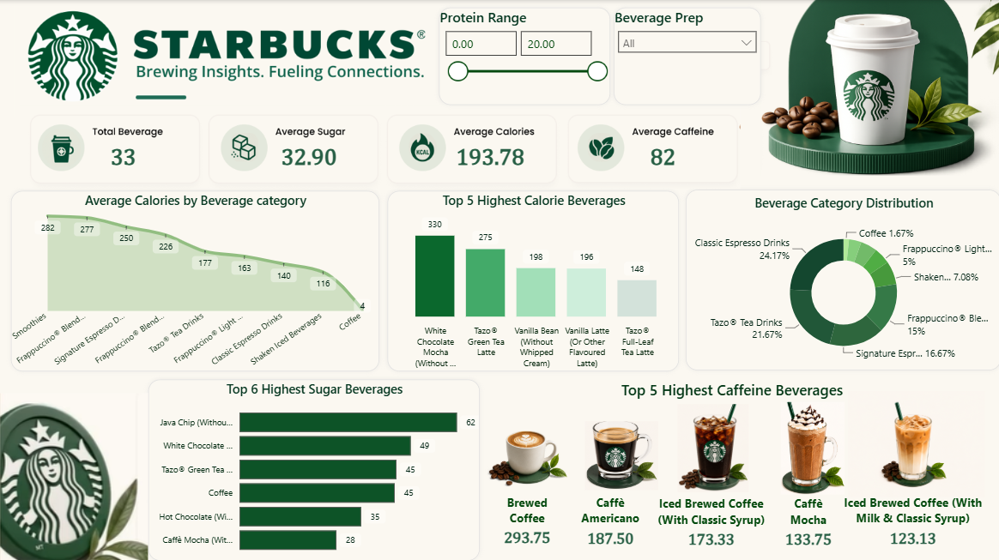

# ☕ Starbucks Sales Analysis Dashboard

## 📌 Project Overview

This project is an interactive Power BI dashboard built to analyze Starbucks beverage nutrition data. It provides insights into calories, caffeine, sugar, and beverage categories using interactive visualizations.

---

## 📊 Dashboard Preview

> *(Upload your dashboard screenshot in the Images folder and replace the path below if needed.)*

---

## 🚀 Features

- KPI Cards
  - Total Beverages
  - Average Calories
  - Average Sugar
  - Average Caffeine

- Interactive Filters
  - Protein Range
  - Beverage Prep

- Visualizations
  - Average Calories by Beverage Category
  - Beverage Category Distribution
  - Average Caffeine by Beverage Category
  - Top 5 Highest Caffeine Beverages
  - Top 5 Highest Sugar Beverages

---

## 🛠 Tools Used

- Power BI
- DAX
- Power Query
- Microsoft Excel / CSV

---

## 📂 Dataset

- Starbucks Sales Dataset

---

## 👩‍💻 Author

**Mitali Khapekar**
